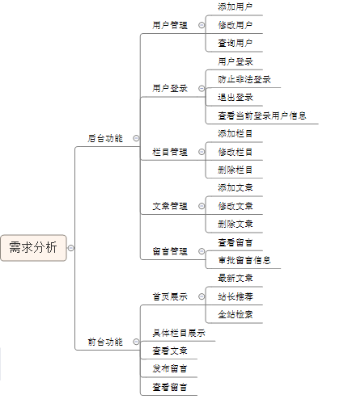
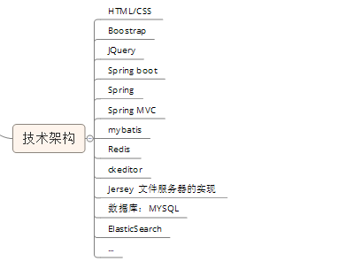

#个人博客系统简介
该系统是基于springBoot设计的一个个人博客系统。

##所实现的功能如下

##本系统使用了一下技术

##有一下模块
> 本系统分为两个模块，分别为myblog-file、myblog-web
> myblog-file:保存文件的服务器
> myblog-web:系统的核心代码模块

##启动方式
> 访问web.直接启动MyblogApplication.java文件即可。
> 开启文件服务器，直接启动myblog-file服务器。
> 系统的sql文件：见目录“相关sql”文件夹
> 系统后台访问的url:http://localhost:8080/back/index 账号：lga 密码：lga
> 系统前台访问的url:http://localhost:8080/front/index

